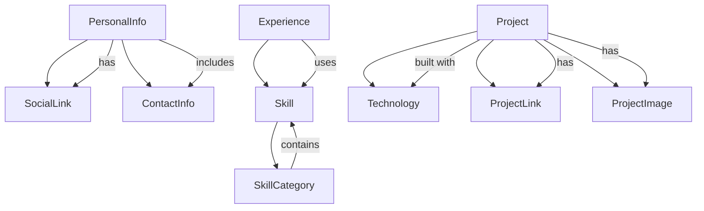

# 数据模型：简约个人网站

**创建日期**: 2025-10-11
**基于**: 功能规格中的关键实体

## 核心实体定义

### 1. 个人信息 (PersonalInfo)

```typescript
interface PersonalInfo {
  id: string
  name: string
  title: string
  bio: string
  avatar: string
  location?: string
  email: string
  phone?: string
  website?: string
  social: SocialLink[]
  createdAt: Date
  updatedAt: Date
}

interface SocialLink {
  platform: 'github' | 'linkedin' | 'twitter' | 'instagram' | 'youtube' | 'custom'
  url: string
  username?: string
  icon?: string
  visible: boolean
}
```

**验证规则**:

- name: 必填，1-50字符
- title: 必填，1-100字符
- bio: 必填，1-500字符
- email: 必填，有效邮箱格式
- social: 最多10个链接

### 2. 技能列表 (Skill)

```typescript
interface Skill {
  id: string
  name: string
  category: 'technical' | 'soft' | 'tool' | 'language'
  level: 1 | 2 | 3 | 4 | 5 // 1=初级, 5=专家
  description?: string
  tags: string[]
  visible: boolean
  order: number
  createdAt: Date
  updatedAt: Date
}

interface SkillCategory {
  id: string
  name: string
  description?: string
  skills: Skill[]
  order: number
}
```

**验证规则**:

- name: 必填，1-50字符
- level: 必填，1-5整数
- category: 必填，预定义枚举值
- tags: 最多5个标签，每个标签1-20字符

### 3. 经历时间线 (Experience)

```typescript
interface Experience {
  id: string
  type: 'work' | 'education' | 'achievement' | 'milestone'
  title: string
  organization: string
  location?: string
  startDate: Date
  endDate?: Date // null表示当前
  description: string
  achievements?: string[]
  skills?: string[] // 关联的技能ID
  visible: boolean
  order: number
  createdAt: Date
  updatedAt: Date
}

interface ExperienceTimeline {
  experiences: Experience[]
  totalExperience: number // 总工作月数
  currentPosition?: Experience
}
```

**验证规则**:

- title: 必填，1-100字符
- organization: 必填，1-100字符
- description: 必填，1-1000字符
- startDate: 必填，不能晚于当前日期
- endDate: 如果提供，不能早于startDate

### 4. 项目作品 (Project)

```typescript
interface Project {
  id: string
  title: string
  description: string
  shortDescription: string // 用于列表展示
  technologies: Technology[]
  type: 'web' | 'mobile' | 'desktop' | 'other'
  status: 'completed' | 'in-progress' | 'planned' | 'archived'
  startDate: Date
  endDate?: Date
  links: ProjectLink[]
  images: ProjectImage[]
  features?: string[]
  challenges?: string[]
  outcomes?: string[]
  visible: boolean
  featured: boolean // 是否为精选项目
  order: number
  createdAt: Date
  updatedAt: Date
}

interface Technology {
  name: string
  category: 'frontend' | 'backend' | 'database' | 'tool' | 'language' | 'framework'
  proficiency: 1 | 2 | 3 | 4 | 5
}

interface ProjectLink {
  type: 'demo' | 'source' | 'docs' | 'download' | 'other'
  url: string
  title: string
  visible: boolean
}

interface ProjectImage {
  url: string
  alt: string
  caption?: string
  order: number
}
```

**验证规则**:

- title: 必填，1-100字符
- description: 必填，1-2000字符
- shortDescription: 必填，1-200字符
- technologies: 至少1个技术栈
- links: 最多5个链接

### 5. 联系方式 (Contact)

```typescript
interface ContactInfo {
  id: string
  email: string
  phone?: string
  address?: Address
  availability?: string
  responseTime?: string
  preferredContact: 'email' | 'phone' | 'social'
  socialLinks: SocialLink[]
  customFields?: CustomField[]
  updatedAt: Date
}

interface Address {
  street?: string
  city?: string
  state?: string
  country?: string
  postalCode?: string
}

interface CustomField {
  key: string
  value: string
  type: 'text' | 'email' | 'url' | 'phone'
  visible: boolean
}
```

**验证规则**:

- email: 必填，有效邮箱格式
- preferredContact: 必填，预定义枚举值
- customFields: 最多10个自定义字段

## 数据关系图



## 状态管理模型

### 全局状态结构

```typescript
interface AppState {
  personal: PersonalInfo
  skills: Skill[]
  experiences: Experience[]
  projects: Project[]
  contact: ContactInfo
  ui: UIState
}

interface UIState {
  theme: 'light' | 'dark' | 'auto'
  language: 'zh-CN' | 'en-US'
  loading: boolean
  errors: string[]
  notifications: Notification[]
}

interface Notification {
  id: string
  type: 'success' | 'error' | 'warning' | 'info'
  message: string
  duration?: number
  timestamp: Date
}
```

### 组合式函数接口

```typescript
// usePersonal.ts
export function usePersonal() {
  const personal = ref<PersonalInfo>()
  const loading = ref(false)
  const error = ref<string>()

  const updatePersonal = async (data: Partial<PersonalInfo>) => {
    // 更新逻辑
  }

  return {
    personal: readonly(personal),
    loading: readonly(loading),
    error: readonly(error),
    updatePersonal
  }
}

// useProjects.ts
export function useProjects() {
  const projects = ref<Project[]>([])
  const featuredProjects = computed(() =>
    projects.value.filter(p => p.featured && p.visible)
  )

  const getProjectById = (id: string) =>
    projects.value.find(p => p.id === id)

  return {
    projects: readonly(projects),
    featuredProjects,
    getProjectById
  }
}
```

## 数据验证规则

### 通用验证函数

```typescript
// validators/index.ts
export const validators = {
  required: (value: any) => !!value || '此字段为必填项',
  email: (value: string) =>
    /^[^\s@]+@[^\s@][^\s.@]*\.[^\s@]+$/.test(value) || '请输入有效的邮箱地址',
  url: (value: string) =>
    /^https?:\/\/.+/.test(value) || '请输入有效的URL',
  minLength: (min: number) => (value: string) =>
    value.length >= min || `最少需要${min}个字符`,
  maxLength: (max: number) => (value: string) =>
    value.length <= max || `最多允许${max}个字符`,
  date: (value: string) =>
    !Number.isNaN(Date.parse(value)) || '请输入有效的日期',
  phone: (value: string) =>
    /^\+?[1-9]\d{0,15}$/.test(value) || '请输入有效的电话号码'
}

// 组合验证器
export function createValidator(rules: Array<(value: any) => string | true>) {
  return (value: any) => {
    for (const rule of rules) {
      const result = rule(value)
      if (result !== true)
        return result
    }
    return true
  }
}
```

### 实体验证函数

```typescript
// validators/entities.ts
export function validatePersonalInfo(data: Partial<PersonalInfo>) {
  const errors: Record<string, string> = {}

  if (!validators.required(data.name)) {
    errors.name = '姓名为必填项'
  }
  else if (typeof validators.minLength(1)(data.name) !== 'boolean') {
    errors.name = '姓名不能为空'
  }
  else if (typeof validators.maxLength(50)(data.name) !== 'boolean') {
    errors.name = '姓名不能超过50个字符'
  }

  if (!validators.required(data.title)) {
    errors.title = '职业头衔为必填项'
  }

  if (!validators.required(data.bio)) {
    errors.bio = '个人简介为必填项'
  }

  if (!validators.required(data.email)) {
    errors.email = '邮箱为必填项'
  }
  else if (typeof validators.email(data.email) !== 'boolean') {
    errors.email = '请输入有效的邮箱地址'
  }

  return errors
}

export function validateProject(data: Partial<Project>) {
  const errors: Record<string, string> = {}

  if (!validators.required(data.title)) {
    errors.title = '项目标题为必填项'
  }

  if (!validators.required(data.description)) {
    errors.description = '项目描述为必填项'
  }

  if (!data.technologies || data.technologies.length === 0) {
    errors.technologies = '至少需要选择一个技术栈'
  }

  return errors
}
```

## 数据迁移策略

### 初始数据结构

```typescript
// data/initial-data.ts
export const initialData: Partial<AppState> = {
  personal: {
    id: '1',
    name: 'bee1an',
    title: 'Frontend Developer',
    bio: '专注于现代Web开发技术，热爱创造优秀的用户体验。',
    avatar: '/images/avatar.png',
    email: 'beelan@yeah.net',
    social: [
      {
        platform: 'github',
        url: 'https://github.com/bee1an',
        username: 'yourusername',
        visible: true
      }
    ],
    createdAt: new Date(),
    updatedAt: new Date()
  },
  skills: [],
  experiences: [],
  projects: [],
  contact: {
    id: '1',
    email: 'beelan@yeah.net',
    preferredContact: 'email',
    socialLinks: [],
    updatedAt: new Date()
  }
}
```

### 版本控制

```typescript
// migrations/index.ts
interface Migration {
  version: string
  description: string
  up: (data: any) => any
  down: (data: any) => any
}

export const migrations: Migration[] = [
  {
    version: '1.0.0',
    description: '初始数据结构',
    up: data => data,
    down: data => data
  }
]
```

这个数据模型为简约个人网站提供了完整的类型定义和验证规则，确保数据的完整性和一致性。所有实体都遵循功能规格中的要求，并支持未来的扩展需求。
